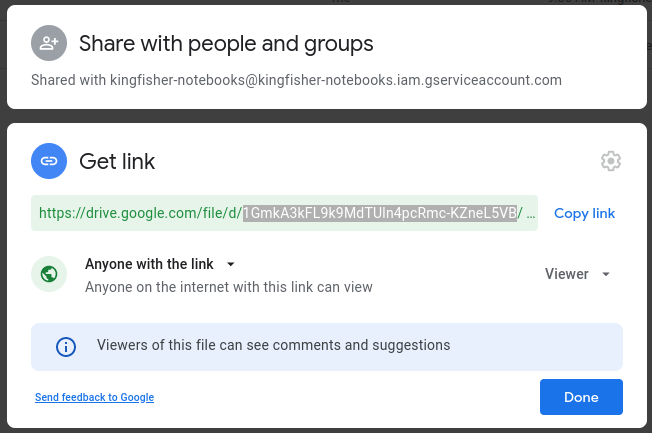

# Kingfisher Notebooks

A collection of components and templates for working with data in OCDS Kingfisher using Jupyter notebooks.

## Components

The notebook components in this repository are the single source of truth for common tasks performed by OCDS Helpdesk analysts. Use the buttons below to open the components from the `main` branch for editing in Google Colaboratory (Colab):

Component | Tasks
-- | --
[Setup environment](https://github.com/open-contracting/kingfisher_notebook_components/blob/main/setup_environment.ipynb)  | Install requirements, import functions, load extensions and set config. Connect to the Kingfisher database.
[Choose data](https://github.com/open-contracting/kingfisher_notebook_components/blob/main/choose_data.ipynb)  | Choose a data source, collection and schema to work with.
[Check for errors](https://github.com/open-contracting/kingfisher_notebook_components/blob/main/check_for_errors.ipynb)  | Check for data collection and processing errors.
[Check scope](https://github.com/open-contracting/kingfisher_notebook_components/blob/main/check_scope.ipynb)  | Check how many releases and records your data contains. Check the date range and stages of the contracting process covered by your data.
[Check structure and format](https://github.com/open-contracting/kingfisher_notebook_components/blob/main/check_structure_and_format.ipynb)  | Check for structure and format errors reported by the Data Review Tool.
[Check quality](https://github.com/open-contracting/kingfisher_notebook_components/blob/main/check_data_quality.ipynb)  | Check for conformance and coherence errors.

To open a component from a different branch, use Colab's [GitHub browser](https://colab.research.google.com/github/open-contracting/kingfisher_notebook_components/) to choose the component and branch you want to open.

Alternatively, you can use the Open in Colab browser extension ([Chrome](https://chrome.google.com/webstore/detail/open-in-colab/), [Firefox](https://addons.mozilla.org/en-US/firefox/addon/open-in-colab/)) to add a button that, when clicked when viewing a Jupyter notebook on GitHub, will open that notebook in Colab.

## Templates

Each time a component is updated, GitHub Actions builds template notebooks from the components and writes them to a [Google Drive folder](https://drive.google.com/drive/u/0/folders/1eb3pSQ55HylMsmwKqu7MrkvH12ROD4-9).

The following table describes the relationship between the templates and components. Use the links to open the templates in [Google Colaboratory](https://colab.research.google.com/) and then save a copy to use in your analysis.

Template | Description | Setup environment | Choose data | Check for errors | Check scope | Check structure and format | Check data quality
-- | -- | -- | -- | -- | -- | -- | --
[Publisher analysis template](https://colab.research.google.com/drive/11Z3RAhI97Dan2usiuN5CUWwfJ23WLNob) | Use to analyse data from a specific publisher | :heavy_check_mark: | :heavy_check_mark: | :heavy_check_mark: | :heavy_check_mark: | |
[Meta analysis template](https://colab.research.google.com/drive/1NXYvi3eHOWlFHXzcg7Vhw3xNJpNXcqx1) | Use to analyse data from multiple publishers, or to perform other types of analysis on the Kingfisher database | :heavy_check_mark: | | | | |
[Structure and format feedback template](https://colab.research.google.com/drive/1GmkA3kFL9k9MdTUln4pcRmc-KZneL5VB) | Use to provide feedback on structure and format issues reported by the Data Review Tool | :heavy_check_mark: | :heavy_check_mark: | :heavy_check_mark: | :heavy_check_mark: | :heavy_check_mark: |
[Data quality feedback template](https://colab.research.google.com/drive/1Lj96xTde5GpFQ5hnvB2GYZ7gY4wuvUYt) | Use to provide detailed feedback on structure and format, conformance and coherence issues | :heavy_check_mark: | :heavy_check_mark: | :heavy_check_mark: | :heavy_check_mark: | :heavy_check_mark:
Usability checks template | Use to provide feedback on data usability | | | | | |

## Contributing

### Add or edit a component

1. [Create a new notebook](https://colab.research.google.com/#create=true), or open an existing component in Colab.
2. Add or edit cells, following the [style guide for SQL statements](https://ocp-software-handbook.readthedocs.io/en/latest/python/code.html#sql-statements). For new components, set a title using H2 formatting.
3. Format any SQL code you add or edit, using [pg_format](https://github.com/darold/pgFormatter) with the following options: `pg_format -f 1`. Alternatively, you can use the [online version](https://sqlformat.darold.net/) and set the **Functions** option to 'lowercase'.

### Commit your changes

1. [Create a branch](https://docs.github.com/en/free-pro-team@latest/github/collaborating-with-issues-and-pull-requests/creating-and-deleting-branches-within-your-repository#creating-a-branch).

In Colab:

1. Click Edit -> Clear all outputs.
1. Click File -> Save a copy in GitHub.
1. Uncheck 'Include a link to Colaboratory'
1. Select your branch, enter a commit message and click OK.

### Update templates with new components

For new components:

1. Add the component to the `nbmerge` commands in the 'Merge notebooks' section of [`main.yml`](https://github.com/open-contracting/kingfisher_notebook_components/blob/main/.github/workflows/main.yml) as required.
2. Update the 'Components' and 'Templates' sections of `README.md`.

### Add a new template

1. Add a new step to the 'Merge notebooks' section of [`main.yml`](https://github.com/open-contracting/kingfisher_notebook_components/blob/main/.github/workflows/main.yml) with the `nbmerge` command to generate the template, e.g. `nbmerge component_1.ipynb component_2.ipynb > new_template.ipynb`.
2. Upload an empty file to the [Kingfisher Notebooks Google Drive folder](https://drive.google.com/drive/u/0/folders/1eb3pSQ55HylMsmwKqu7MrkvH12ROD4-9) and get its Google Drive file ID from the 'Get link' menu option.

    

3. Add a new entry to the `files` list in the [`upload`](https://github.com/open-contracting/kingfisher_notebook_components/blob/main/manage.py) function in `manage.py`, e.g. `('file_id', 'new_template.ipynb', 'New Template Title')`
4. Update the 'Templates' section of `README.md`.

### Request a review

1. [Create a pull request](https://docs.github.com/en/free-pro-team@latest/github/collaborating-with-issues-and-pull-requests/creating-a-pull-request).
2. Request a review from a helpdesk analyst.
3. If the reviewer requests changes, make the changes then repeat this step.

### Merge your changes

Once approved, you can merge your own changes.

## Reviewing

### Review changes

[Review the changes](https://docs.github.com/en/free-pro-team@latest/github/collaborating-with-issues-and-pull-requests/reviewing-proposed-changes-in-a-pull-request).

For small changes, you can review the raw diff in the GitHub review interface.

For larger changes, you can review and comment on a visual diff by clicking the  button. You need to authorize the app the first time you open it.

# Maintenance

## Format SQL cells in all notebooks:

1. Install [pg_format](https://github.com/darold/pgFormatter).
2. Run `./manage.py pre-commit`.
